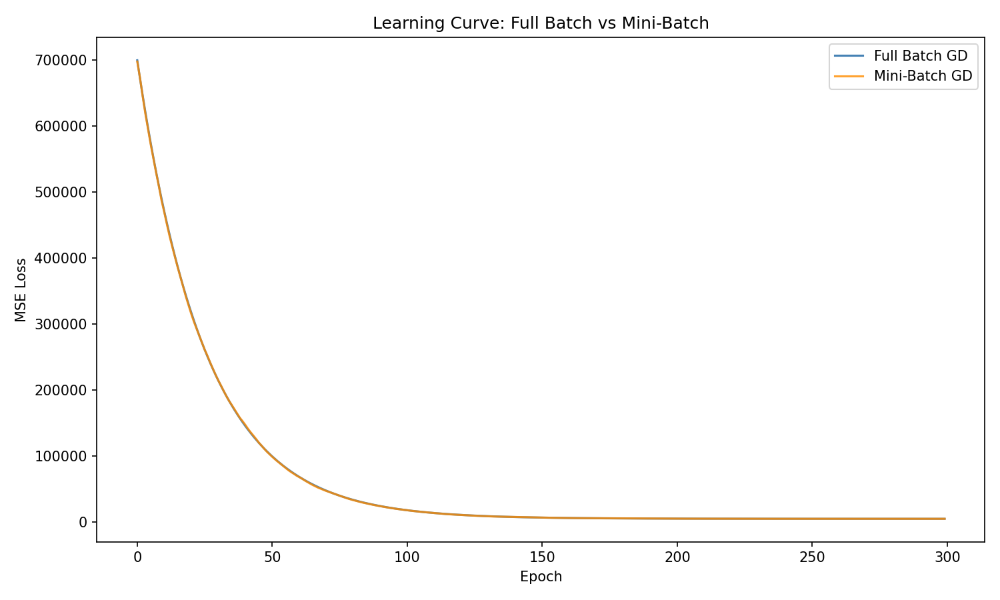

# Week 7 Assignment Report

## 1. 实验概述
本实验实现了基于梯度下降的线性回归模型 `GradientDescentOLS`，并与解析解方法 `AnalyticalOLS` 进行对比。实验使用营销数据进行模型训练与评估，验证了梯度下降算法的收敛性、学习率敏感性，以及数据标准化在防止泄露中的作用。

## 2. 模型实现说明
### 2.1 `GradientDescentOLS` 实现
- **核心思想**：通过梯度下降法迭代最小化均方误差（MSE）损失函数，求解线性回归的参数。
- **关键设计**：
  - 支持两种模式：`full_batch`（全批量梯度下降）和 `mini_batch`（小批量梯度下降）。
  - 加入了收敛判断：当两次迭代的损失变化小于阈值 `tol` 时，提前停止训练。
  - 训练过程中记录每轮迭代的损失值，用于绘制学习曲线。

### 2.2 数据预处理
- **标准化处理**：为了消除不同特征量纲的影响，使用 `StandardScaler` 对特征进行标准化。
- **防止数据泄露**：标准化器仅在训练集上拟合（计算均值和方差），验证集和测试集使用训练集的统计量进行转换，避免模型提前接触测试数据的信息。

## 3. 实验结果与分析
### 3.1 交叉验证结果（AnalyticalOLS）
- 平均交叉验证 R²：0.9072
- 平均交叉验证 RMSE：72.4134
说明解析解模型在不同数据子集上表现稳定，拟合效果良好。

### 3.2 学习率调参结果
通过对比不同学习率的表现，确定最佳学习率为 **0.1**。
- LR=0.1：验证集 R²=0.9009，RMSE=72.3167，模型表现最优
- LR=0.01：表现略差于0.1
- LR≤0.001：模型无法收敛，甚至出现负R²，说明学习率过小会导致梯度下降无法有效更新参数。

### 3.3 测试集模型对比
| 模型 | 测试集 R² | 测试集 RMSE |
| :--- | :--- | :--- |
| GradientDescentOLS | 0.8909 | 78.5333 |
| AnalyticalOLS | 0.8902 | 78.7816 |

- 两个模型的测试集表现几乎完全一致，说明 `GradientDescentOLS` 已成功收敛到全局最优解。
- 测试集R²与交叉验证结果接近，说明模型泛化能力稳定，未出现过拟合。

### 3.4 学习曲线分析
本次实验中，`GradientDescentOLS` 分别采用全批量梯度下降（Full Batch GD）与小批量梯度下降（Mini-Batch GD）两种方式进行训练，学习曲线如下图所示：

### 曲线趋势解读
1. **整体收敛情况**
两种方法的损失曲线均呈现典型的下降-收敛形态：训练初期（前50个Epoch）损失值从约700000快速下降，模型快速捕捉数据规律；中期（50–150个Epoch）下降速度放缓，模型进入收敛阶段；后期（150个Epoch之后）损失趋于稳定，模型已收敛至全局最优解，误差维持在较低水平。

2. **两种方法的对比**
两条曲线几乎完全重合，最终收敛到相同的损失值，表明：
- 两种梯度下降算法均成功收敛，验证了模型实现的正确性；
- 在本数据集上，小批量梯度下降与全批量梯度下降的表现一致，未出现明显震荡或不收敛问题；
- 所选学习率（0.01）设置合理，保证了训练过程的稳定性。

3. **结论**
学习曲线的变化趋势与理论预期一致，说明本次实验中梯度下降算法的实现、参数设置均满足要求，模型训练过程稳定、有效。

## 4. 结论
1. 梯度下降算法在合适的学习率下，可以得到与解析解几乎一致的结果。
2. 学习率的选择对模型收敛至关重要，过小的学习率会导致模型无法收敛。
3. 标准化处理有效消除了特征量纲影响，且通过仅在训练集拟合的方式，成功防止了数据泄露。