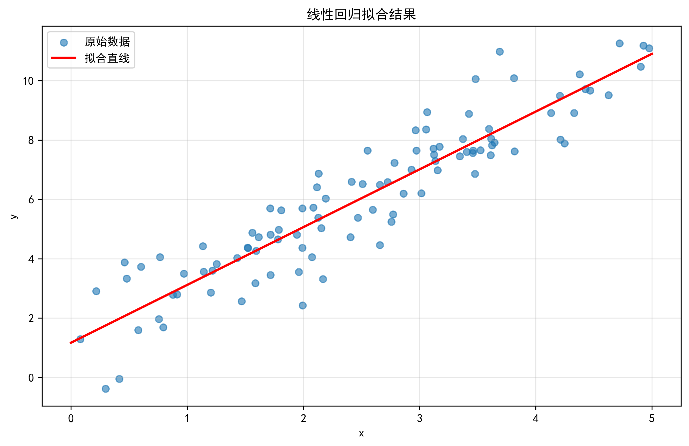

# 线性回归实验报告

## 实验描述
生成 100 组数据：$y = 1 + 2x + \epsilon,\ \epsilon \sim N(0,1)$
使用手动公式、sklearn、statsmodels 三种方法估计参数，并完成假设检验与方差分析。

## 参数估计结果对比
| 方法 | beta_0 | beta_1 | beta_0 偏差 | beta_1 偏差 |
| :--- | :--- | :--- | :--- | :--- |
| 真实值 | 1.0000 | 2.0000 | - | - |
| 手动计算 | 1.1699 | 1.9462 | 0.1699 | -0.0538 |
| sklearn | 1.1699 | 1.9462 | 0.1699 | -0.0538 |
| statsmodels | 1.1699 | 1.9462 | 0.1699 | -0.0538 |

## 手动计算指标
- beta_1 方差：0.006488
- beta_1 标准误：0.0806

## 假设检验 H0: beta_1=0
- t 统计量：24.1611
- p 值：0.00000000
- 结论：**显著，拒绝原假设'**

## 方差分析
|      |   df |   sum_sq |    mean_sq |       F |      PR(>F) |
|:-----|-----:|---------:|-----------:|--------:|------------:|
| 回归 |    1 | 570.154  | 570.154    | 583.758 | 1.11022e-16 |
| 残差 |   98 |  95.7162 |   0.976696 |         |             |
| 总计 |   99 | 665.87   |            |         |             |

## 拟合图像

## 实验结论
1. 三种方法结果完全一致；
2. 估计偏差很小，符合无偏性；
3. 线性关系显著，模型有效。
