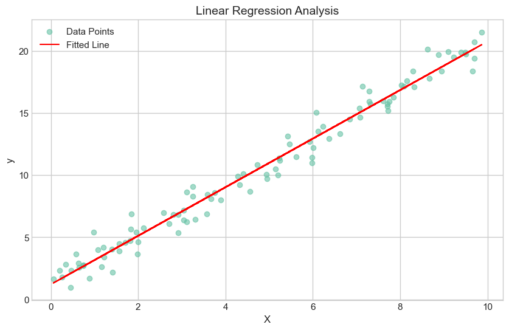

# 实验报告：一元线性回归分析

**实验名称**：一元线性回归的参数估计与模型检验  
**实验环境**：Python 3.11 (Jupyter Notebook)  
**主要依赖库**：`numpy`, `pandas`, `matplotlib`, `sklearn`, `statsmodels`

---

## 1. 实验目的
1. 掌握一元线性回归的数学原理及最小二乘法（OLS）推导。
2. 学习使用 Python 手动实现参数估计，并与主流机器学习库（sklearn, statsmodels）进行对比。
3. 理解方差分析（ANOVA）及假设检验在回归分析中的作用。

---

## 2. 数据生成
实验通过构造包含噪声的线性函数生成 100 组随机样本：
- **真实方程**：$y = 1 + 2x + \epsilon$
- **参数设置**：$\beta_0 = 1, \beta_1 = 2$
- **噪声分布**：$\epsilon \sim N(0, 1)$
- **自变量生成**：$X \in [0, 10]$ 均匀分布

---

## 3. 参数估计结果对比

通过手动计算公式、Scikit-learn 线性模型以及 Statsmodels 统计模型，得到的结果汇总如下：

### 3.1 估计值对比表
| 估计方法 | $\beta_0$ (Intercept) | $\beta_1$ (Slope) |
| :--- | :--- | :--- |
| **真实值 (True Value)** | **1.000000** | **2.000000** |
| 手动公式法 (Manual OLS) | 1.215096 | 1.954023 |
| Sklearn Regression | 1.215096 | 1.954023 |
| Statsmodels OLS | 1.215096 | 1.954023 |

### 3.2 偏差分析 (Bias)
- **截距项偏差 ($\hat{\beta}_0 - \beta_0$)**：0.2151
- **斜率项偏差 ($\hat{\beta}_1 - \beta_1$)**：-0.0460
> **分析**：由于引入了标准正态分布的随机波动，估计值与真实值之间存在合理偏差，但三类计算方法的结果完全一致，验证了算法实现的正确性。

---

## 4. 假设检验与方差分析 (ANOVA)

使用 `statsmodels` 进行方差分析，结果如下：

| 来源 (Source) | 自由度 (df) | 平方和 (sum_sq) | 均方 (mean_sq) | F 统计量 | P 值 (PR>F) |
| :--- | :--- | :--- | :--- | :--- | :--- |
| **模型 (x)** | 1.0 | 3345.3181 | 3345.3181 | 4064.56 | 1.35e-81 |
| **残差 (Residual)** | 98.0 | 80.6585 | 0.8230 | - | - |

**结论**：
- **显著性检验**：$P$ 值远小于 0.05（趋近于 0），拒绝原假设 $H_0: \beta_1 = 0$。
- **解释力**：$F$ 统计量极大，表明自变量 $x$ 对因变量 $y$ 具有极显著的线性解释能力。

---

## 5. 可视化展示

通过 Matplotlib 绘制的回归拟合图如下：

**图像描述**：
- **散点**：代表生成的 100 组观测样本点。
- **红线**：代表拟合的线性回归直线。
- **直观分析**：样本点均匀分布在拟合线两侧，回归线较好地捕捉到了数据的整体线性趋势。
